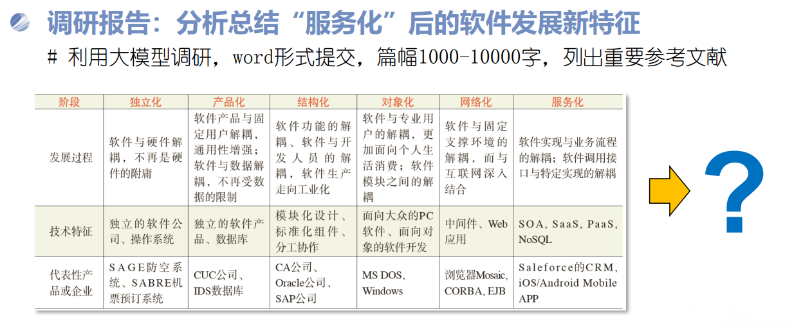

# 背景

软件的发展经历过独立化、产品化、结构化、对象化、网络化、服务化六个阶段(大数据时代的软件工程关键技术, 中国计算机学会通讯, 2014;10(3):8-18)，随着chatgpt的出现、生成式ai的爆发、agent的落地应用，我断言，软件发展将进入智能化的时代。

# 智能化阶段的技术特征

如果说服务化阶段解决的是“如何把软件能力封装成服务，并通过网络按需调用”，那么智能化阶段正在改变一个更底层的问题：谁来决定软件下一步做什么。

传统软件的控制逻辑由程序员事先写入代码。无论采用结构化、面向对象还是微服务架构，程序运行的基本方式仍是确定的：输入进入预设流程，条件判断决定分支，服务按照编排执行。生成式 AI 和 Agent 出现以后，一部分控制逻辑开始从“开发时写死”转移到“运行时生成”。Agent 接收的可以只是一个目标，例如“分析这家公司并生成报告”“修复这个 GitHub Issue”或“帮我订一套符合预算的行程”，模型随后自行拆解任务、选择工具、读取结果，再决定下一步行动。OpenAI 在 2025 年推出 Responses API、Web Search、File Search、Computer Use 和 Agents SDK 时，将 Agent 定义为能够代表用户独立完成任务的系统；微软的 Copilot Studio 同样开始支持能够自主选择和串联 Action、执行长周期任务的 Autonomous Agent。

因此，智能化软件最突出的第一个特征，是控制流从预编程向“推理—行动—观察—再推理”的动态闭环扩展。传统程序仍负责数据库事务、权限校验、支付、计算等需要确定性的操作，但“应该调用哪个程序、按什么次序调用、失败后如何调整”开始交给模型判断。大模型不再只是软件中的一个文本生成模块，而逐渐进入软件的控制平面。

第二个变化发生在软件接口。服务化时代依赖 API：开发者知道要调用哪个服务，并按照固定参数编写集成代码；Agent 则要求自己发现和使用工具。2024 年 Anthropic 发布 Model Context Protocol（MCP），试图用统一协议连接模型与数据库、文件系统、企业应用和开发工具，将其比作 AI 应用的“USB-C”。OpenAI、Anthropic等厂商又进一步引入 Computer Use，使 Agent 在缺少专门 API 时也可以通过图形界面操作既有软件。 这意味着软件接口正在出现新的使用者——过去界面主要服务于人，API 主要服务于程序；智能化阶段的软件还必须考虑如何被另一个智能体理解、发现和操作。工具描述、权限边界、机器可读语义正在成为新的接口设计问题。

第三个变化首先在软件工程行业内部爆发，即代码生成正在升级为软件工程任务代理。第一代 AI 编程工具主要完成单行补全和函数生成，而新一代 Coding Agent 已经能够读取整个代码仓库、定位问题、编辑多个文件、运行命令和测试，再依据测试结果继续修改。Cursor 对 Coding Agent 的定义就是：用户用自然语言描述目标，Agent 自行规划、编辑文件、运行命令并检查结果；Anthropic 的 Claude Code 则可以搜索代码、修改文件、运行测试，甚至处理 GitHub 工作流。

这种变化已经可以从基准测试中观察到，而不仅仅是产品宣传。Stanford《2025 AI Index》记录，在考察真实 GitHub Issue 修复能力的 SWE-bench 上，最佳系统解决问题的比例从 2023 年的 4.4% 上升到 2024 年的 71.7%。 这并不意味着程序员已经可以退出软件工程，而意味着软件开发的抽象层次正在再次上移：汇编语言让程序员不再直接操作机器指令，高级语言让程序员不再管理大量寄存器和跳转，而 Coding Agent 开始让开发者减少对具体实现步骤的逐条描述。人的工作进一步集中到需求、架构、约束、测试、评审和责任判断上，模型承担越来越多实现工作。

第四个变化是，上下文开始成为一种新的运行时状态。传统软件的状态主要存储在变量、数据库和文件中；智能软件的行为除了取决于代码和数据，还取决于模型当前获得了什么上下文——系统指令、历史对话、企业知识库、检索结果、用户偏好、工具返回值以及其他 Agent 的输出，都可能改变下一步行为。因此，大模型应用的核心工程问题正在从早期的 Prompt Engineering 转向更广义的 Context Engineering：什么信息应该进入上下文、什么时候进入、保留多久、由谁可见，以及信息之间发生冲突时以什么为准。Anthropic 的 MCP、Files API 和 Prompt Caching，以及微软 Copilot Studio 中的 Knowledge、Tools 和 Actions，本质上都在建设这一新的“智能运行时”。

第五个变化是，软件可靠性工程开始面对概率系统。传统程序在相同状态下原则上沿固定逻辑执行，而模型的输出具有概率性，Agent 又会把这种不确定性进一步传递到工具选择和长链路任务中。因此，传统的单元测试、集成测试和日志还不够，Agent 系统增加了 Evaluation、Tracing、Guardrail、Sandbox、权限控制、人工审批和执行预算等机制。OpenAI 在 Agents SDK 中把 tracing 作为平台能力，微软将 Copilot Studio 与 Purview、Sentinel 等审计和治理体系连接，Salesforce 的 Agentforce 也把 Agent 的监控、调试和分析纳入平台。 智能化软件的工程目标不再只是“程序有没有 Bug”，还包括“模型是否作出了正确决定，以及错误决定是否能够被限制在可接受范围内”。

最后，智能化还改变了软件的成本模型。传统软件编译完成后，同一段逻辑重复执行的边际成本主要来自 CPU、存储和网络；智能软件的每一次“思考”本身都有明显的推理成本和延迟。Stanford AI Index 指出，推理型模型通过增加 test-time compute 显著提高复杂任务能力，但以当时的模型为例，OpenAI o1 的推理成本接近 GPT-4o 的六倍，速度则慢约三十倍。 因此模型路由、Token 预算、上下文压缩、缓存、小模型与大模型协同，正在成为与数据库索引、并发控制类似的系统设计问题。

由此看，所谓“软件智能化”不能简单定义为“软件中加入了 AI”。更准确的分界线是：软件开始具有目标理解、动态规划、工具使用、环境反馈和自我修正能力。程序员不必事先穷举每一个执行步骤，软件也能够在给定目标和权限边界内形成执行路径。 如果面向对象阶段的基本抽象是 Object，服务化阶段的基本抽象是 Service，那么智能化阶段正在形成一个新的核心抽象——Agent。

# 智能化阶段的代表公司

智能化阶段目前尚未形成像 Windows、Oracle 或 AWS 那样稳定的产业格局，但已经出现几条相当清晰的技术路线。判断一家公司的代表性，不能只看模型参数，而应看它正在定义智能软件产业链中的哪一层。

OpenAI：从“大模型提供商”走向 Agent Runtime。 ChatGPT 证明了自然语言可以成为通用人机接口，但 OpenAI 后续更重要的变化，是把模型从“回答问题的 API”变成“执行任务的基础设施”。2025 年推出的 Responses API 将推理、状态和工具调用整合在同一个接口中，同时提供 Web Search、File Search、Computer Use 和 Agents SDK。 这条路线的意义在于，它试图占据智能软件时代类似“应用运行时”的位置：开发者提供业务逻辑和工具，模型负责理解目标和编排行动。

Anthropic：一边做模型，一边定义 Agent 与软件世界之间的协议。 Anthropic 的代表性不只来自 Claude 的推理和代码能力，更来自 MCP 和 Claude Code。MCP 把“如何让模型连接企业数据和工具”从厂商私有集成提升成开放协议问题；Claude Code 则直接进入终端和代码仓库，可以搜索代码、编辑文件、运行测试和处理长期工程任务。2025 年 Claude Code 正式发布后，Anthropic又开放相关 SDK，使同一套 Agent Harness 可以被用于构造其他应用。 Anthropic代表的是智能软件中的两个重要方向：工具协议化和 Agentic Software Engineering。

Microsoft 与 Salesforce：争夺企业“数字劳动力”的入口。 如果说 OpenAI 和 Anthropic主要提供智能能力，那么 Microsoft 和 Salesforce 的优势在于它们原本就掌握企业工作流、身份体系和业务数据。Copilot Studio 已经能够让 Agent 根据任务自行选择 Action、组合流程并执行长时间任务，同时继承 Microsoft 365 的权限、审计和治理体系。Salesforce 则把 Agentforce 直接嵌入 CRM，2025 年推出的 Agentforce 2dx 特别强调 Agent 不必等待用户发起聊天，而可以被业务事件主动触发并在后台执行工作。 这里出现的是一个很重要的产业信号：Agent 正从“聊天机器人”变成驻留在业务系统中的软件执行者。

Anysphere（Cursor）：把软件开发变成第一个成熟的 Agent 应用市场。 Cursor 的价值不在于自己训练最大的基础模型，而在于证明了 Model 与 Agent Harness 可以分离。它可以使用不同前沿模型，但在代码索引、上下文组织、工具调用、终端执行、代码评审和后台 Agent 上构建自己的工程系统。Cursor 1.0 已将 Background Agent 和自动代码审查纳入产品，Agent 可以离开当前编辑器会话持续执行工程任务。 这类公司说明，智能化阶段可能出现新的软件基础设施层：基础模型决定智力上限，Agent Harness 决定模型如何在真实环境中工作。

中国公司的技术路线也已经开始分化。

DeepSeek代表的是“智能能力的成本重构和开放化”。 2025 年 1 月发布的 DeepSeek-R1 采用大规模强化学习强化推理能力，同时开放模型权重和技术报告，并允许基于模型输出进行蒸馏。 DeepSeek最重要的产业意义并不只是产生另一个聊天机器人，而是证明高水平推理模型可以以更开放、更低成本的方式进入开发者生态。当基础推理能力迅速商品化，应用公司的竞争重点就会进一步从“有没有模型”转向“有没有数据、工具、场景和 Agent 系统”。

阿里巴巴正在同时押注开源模型与 Agentic Coding。 2025 年发布的 Qwen3-Coder 不再把代码能力定义为代码补全，而直接针对 Agentic Coding、Browser Use 和 Tool Use 训练，并同步开放 Qwen Code。其模型强调仓库级理解、多轮工具交互和环境操作。 这条路线与 Anthropic、Cursor 的趋势相呼应：代码是最适合 Agent 的环境之一，因为执行结果、编译错误和测试用例都可以为模型提供即时反馈，从而形成闭环。

字节跳动与月之暗面则代表 Agent 平台和原生 Agent 产品两种路线。 字节跳动的 Coze 将 Prompt、RAG、Plugin 和 Workflow 集成到一个 Agent 开发平台，并在 2025 年开放 Coze Studio；它试图降低创建智能体的工程门槛。 月之暗面的 Kimi 则进一步向“原生 Agent”推进，从模型回答问题扩展到自动规划、调用工具并交付网站、文档、表格等最终成果，其后续模型还针对 Agentic Tool Use 和 Coding 进行专门训练。 这两类产品共同指向一个变化：用户未来购买的软件功能，可能不再是一个固定菜单中的按钮，而是一个能够接受目标并完成工作的智能执行体。

综合这些公司的路线可以看到，智能化软件产业正在逐渐形成新的分层：底层是 OpenAI、Anthropic、DeepSeek、Qwen、Kimi 等提供的智能模型；中间是 Responses API、MCP、Agent SDK、Coze、Copilot Studio 等组成的Agent Runtime 与工具生态；上层则是 Cursor、Claude Code、Agentforce 以及大量行业 Agent 构成的智能应用。这与过去“操作系统—中间件—应用软件”的分层并不完全相同，却很可能成为下一代软件产业的新基础结构。

# 总结
因此，判断软件是否真正进入“智能化阶段”，一个比“是否接入大模型”更有区分度的标准是：当用户只描述目标，而没有描述完整流程时，软件是否仍然能够理解环境、调用其他软件、处理异常并把任务推进到结果。 当这种能力从少数 Demo 变成软件系统的普遍组成部分，“智能化”才真正具有与结构化、对象化、网络化、服务化相提并论的软件工程意义。